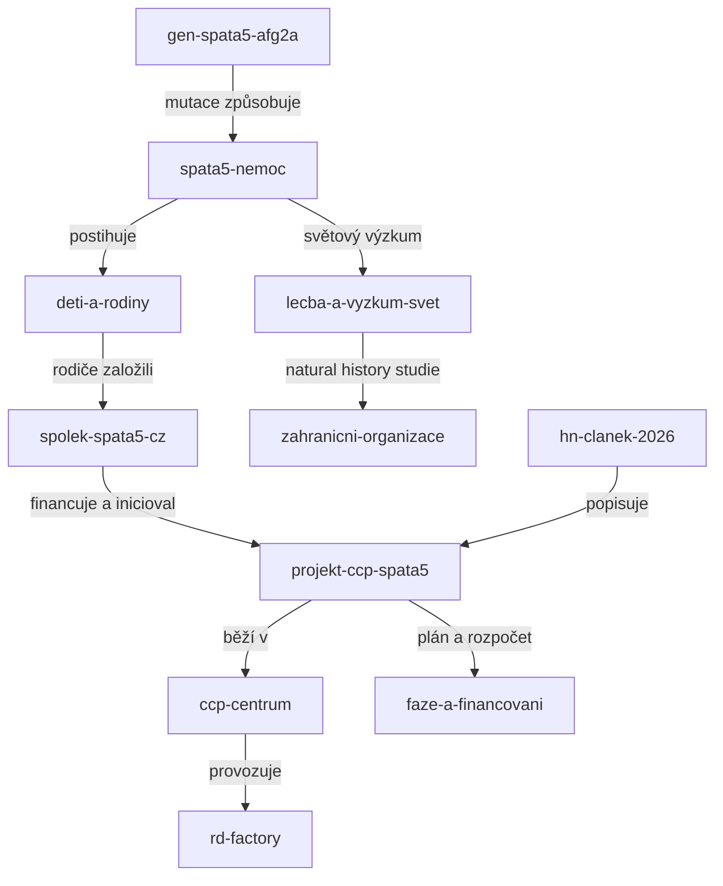

# Mapa znalostního grafu

Rychlá orientace: nemoc [[spata5-nemoc]] je způsobena poruchou genu [[gen-spata5-afg2a]]. V Česku ji má jen několik dětí ([[deti-a-rodiny]]). Jejich rodiče založili spolek [[spolek-spata5-cz]] a zaplatili start výzkumu [[projekt-ccp-spata5]] v centru [[ccp-centrum]] pod vedením Radislava Sedláčka a Jana Procházky. Cílem je genová terapie. Plán a rozpočet popisuje [[faze-a-financovani]].

## Nemoc a věda

- [[spata5-nemoc]] (nemoc): co onemocnění dělá, příznaky, prognóza
- [[gen-spata5-afg2a]] (gen): gen, protein a mechanismus nemoci
- [[diagnostika]]: jak se nemoc pozná
- [[lecba-a-vyzkum-svet]]: co dnes pomáhá a co se zkoumá ve světě
- [[epidemiologie]]: kolik pacientů je známo a odkud

## Český výzkum

- [[projekt-ccp-spata5]] (projekt): co přesně čeští vědci dělají
- [[faze-a-financovani]]: tři fáze výzkumu, rozpočet 33 až 49 mil. Kč, sbírky
- [[rd-factory]] (projekt): širší český program pro vzácné nemoci

## Organizace a pacienti

- [[spolek-spata5-cz]] (organizace): rodičovský spolek, web zazracnedeti.cz
- [[ccp-centrum]] (organizace): České centrum pro fenogenomiku
- [[zahranicni-organizace]]: SPATA Foundation, studie v Göttingenu
- [[deti-a-rodiny]] (pacienti): veřejně známé české děti s diagnózou

## Média a zdroje

- [[media-chronologie]] (media): všechny nalezené články a výstupy
- [[hn-clanek-2026]] (media): klíčový článek Hospodářských novin
- [[vedecke-publikace]] (zdroj): odborná literatura s PMID a DOI
- [[databaze]] (zdroj): OMIM, Orphanet, ClinVar a další

## Analýzy a další kroky

- [[ai-prilezitosti]] (analyza): kde může pomoci AI
- [[inspirace]] (analyza): zahraniční firmy a neziskovky spojující AI a vzácné nemoci
- [[todo]] (analyza): úkoly a otevřené otázky z obou analýz

## Vizuální mapa

